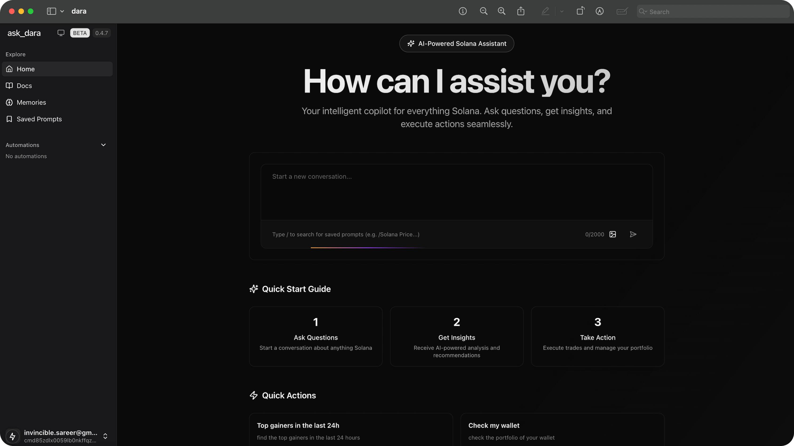

# Dara

> The Intelligent Copilot for Solana

Dara is an **open-source**, full-stack application that combines advanced LLM models with blockchain technology. Built for the [Solana](https://solana.com/) ecosystem, Dara enables seamless, intelligent interactions with DeFi protocols, NFTs, and more.

---

## Quick Links

-  [App](https://dara.sh)
-  [Docs](https://docs.dara.sh)
-  [Twitter (X)](https://x.com/ask_Dara)
-  [Discord](https://discord.gg/dara)
-  [GitHub](https://git.new/dara)

---

## Features

- **Modern UI**: Responsive, mobile-first design with Tailwind CSS and Shadcn UI
- **Intelligent Agent**: Natural language understanding for DeFi, NFTs, and Solana-native actions
- **Smart Tools**: Advanced function-calling for complex blockchain operations
- **Embedded Wallet**: Integrated wallet management and real-time portfolio insights
- **DeFi Integration**: Swaps, staking, and cross-platform DeFi tools
- **NFT Suite**: NFT collection management and analytics
- **Live Analytics**: Real-time market trends and portfolio tracking
- **Ecosystem Access**: Integrations with Jupiter, Magic Eden, and more

## Roadmap

We are building the most advanced interface for the Solana Network, enabling users to design AI agents for autonomous actions and custom strategies. Dara merges live blockchain data with real-time internet insights for a unified crypto management experience.

### Core Infrastructure
- [x] Landing Page
- [x] User Model
- [x] Chat Interface
- [x] Chat Persistence
- [x] Streaming Tool Components
- [x] Embedded Wallet
  - [ ] Migrate to Phantom Embedded Wallet

### Agent Capabilities
- [x] Multi-Tool Usage
- [ ] Multimodal
  - [x] Image
  - [ ] Realtime Voice Conversation
- [ ] Memory Layer
- [ ] Web2 Integration
  - [x] Web Scraping
  - [ ] Twitter Search

### Solana Integration
- [x] SNS (Solana Name Service) Resolver
- [x] Wallet Portfolio
- [ ] Transaction Parser
- [x] NFT Operations
- [x] Basic Token Operations
  - [x] Send/Swap Tokens
  - [x] Token Launch (pump.fun)
- [x] DeFi Integration
  - [x] Jupiter
    - [x] Swaps
    - [x] Price API v2
    - [x] Verified Token Search
    - [ ] Limit Orders
    - [ ] DCA
  - [x] Pump.Fun Integration
    - [x] Deploy Token
  - [x] Dexscreener Integration
    - [x] Token Profile
    - [x] Paid Orders Check
  - [ ] Blinks Integration
  - [x] Magic Eden Integration

### Market Intelligence
- [x] Token Trends (via Defined.fi)
- [x] NFT Trends (via Magic Eden)

### Automation
- [ ] Automated On-Chain Actions
- [ ] Personalized Agent
- [ ] Trading AI

## Getting Started

See [LOCAL_DEV.md](LOCAL_DEV.md) for local development instructions.

## Contributing

We welcome contributions from the community! Please see [CONTRIBUTING.md](CONTRIBUTING.md) for guidelines.

## License

MIT © Dara Projects
